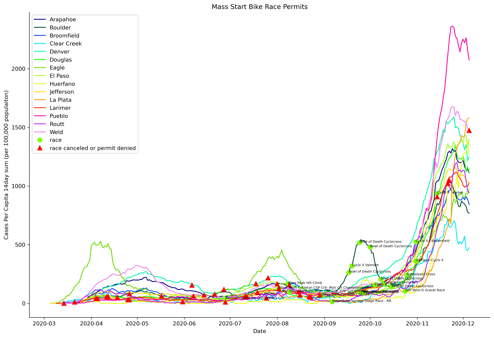

## Covid19 Cases and Cycling Races

### Author: Margot Clyne

#### Contact info:
email: margot.clyne@colorado.edu
instagram: [@margotclyne](https://www.instagram.com/margotclyne/?hl=en)

# Project Overview
 Topic: A look at what was going on with Covid19 cases in Colorado, and the impact on cycling races in terms of race permits awarded to the Bicycle Racing Association of Colorado by county.
 
## Introduction:  
Sports are an integral part of [American Society](https://usa.usembassy.de/sports.htm). For many Americans, the abrupt realization that the coronavirus was about to actually rattle life as we knew it came when the [NBA shut down, followed almost immediatly](https://bleacherreport.com/articles/2880569-timeline-of-coronavirus-impact-on-sports) by seemingly every professional sports league in the country. Two days later, the president [declared the coronavirus outbreak a national emergency](https://www.washingtonpost.com/world/2020/03/13/coronavirus-latest-news/).


The UCI ([Union Cycliste Internationale](https://www.uci.org/inside-uci/about/about-the-uci)) is the world governing body for cycling. The heighest level of road bike racing is the [UCI World Tour](https://en.wikipedia.org/wiki/2020_UCI_World_Tour) and the [UCI Women's World Tour](https://en.wikipedia.org/wiki/2020_UCI_Women%27s_World_Tour). There was a complete pause of UCI racing that lasted approximately from March through August 1st. Similar to other professional sports, many professional level cycling races were able to develop ["race bubbles" complete with covid testing requirements, etc](https://www.uci.org/news/2020/the-uci-draws-very-positive-conclusions-from-management-of-2020-season-affected-by-the-covid-19-pandemic) (example: the 2020 Tour De France). These race bubbles are costly to maintain, and so not all race events were equal in their implementation. 


Cycling in the United States is less popular than in Europe, and more travel is required. In the end, even the largest professional races ([such as the Colorado Classic](https://www.coloradoclassic.com/)) or league ([USA Crits](https://usacrits.com/)) did not have the resources or logistical ability to create and maintain a "race bubble" that was safe for athletes, staff, and the surrounding communuties, and also financially viable, and were therefore canceled. However, some smaller mixed pro/amatuer races have returned as people have been antsy to return to normal. All races were canceled by USA Cycling (the governing body) until at least June 1st 2020. After that date, individual race organizers were free to apply for race permits. Race permits would be approved by the local racing jusrisdictions (in this case, the Bicycle Racing Association of Colorado - BRAC) if the race plans were approved by local goverments. In many States and/or Counties, local goverment approval was dependent on clearence by the health department. 

# Scope of This Project:
For many people, the return of sports indicates a return to a semblence of normalicy. For athletes from all levels, it means returning to doing something we love. But are things really normal? This project looks at mass start races in Colorado through BRAC that either happened or were canceled, and the reported covid19 case rates that were occuring in the background in the counties where those races were (or would have been) located. 

In this project, Individual Time Trial races were excluded from the dataset because athletes are not [drafting](https://www.bicycling.com/training/a20026446/how-to-draft/) from each other and breathing the same air, which is what occurs in mass start (group) races. Velodrome (Track Racing) events are also excluded. These excluded races (and others) can be added via the instructions listed in the section "How to run this code and make this plot". None of these races required negative covid tests to participate. 

## Data

Covid19 reported cases by county are from the New York Times database. Population data for each county is from the US census. Bicycling race events data were manually searched for by the author and written into a .csv file called 'BRAC_races_permits.csv'. If any of the race data is incorrect, please contact the author via margot.clyne@colorado.edu . 
     
## Results:
The plot below is of the rolling total number of reported covid19 cases within a 14 day period, per 100,000 residents of each county at the locations where Bicycling race events either occured (green circles) or were canceled (red triangles). 

The events that occured are labeled in text. Please read the section below titled "Important Notes".

<center></center>

## Important Notes:
1) Correlation does not imply causation. This is simply observational data. This applied in both directions:
    a. Regarding races hapening or not: This is just a look at what covid caserates were doing behind the scenes when these races did occur, were [denied permits](https://www.withoutlimits.co/state-cyclocross-championships) (canceled, relocated or postponed), or  were canceled by the race organizers without trying to apply for a new permit (due to finances or just realizing that it is still a pandemic). Factors may include (but are not limited to):
        - County rules about gatherings and events during the pandemic:
            - These vary widely, just as they do throughout the rest of the country. 
            - They also evolve with time. 
        - Adequate time to adapt race plans and submit new permits under changing rules
        - Money. Race events expected to be financial losses were usually canceled early on. 
    
    b. Regarding county caserates after race events: Fingers crossed that bike races are not responsible for causing an outbreak anywhere that would otherwise have been more remote. Many of the  locations where races occured are not typically where the bulk of the athletes actually live, so contact tracing is hard to confine to single counties.

2) While the author is unaware of any race-related transmission at the events in this dataset that has been publicly reported, that does not mean that virus transmission to other racers and/or local community members did not happen. There is also the additional complication for contact tracing: would the people racing at these events be willing to face the potential public shame and report contact tracing? Especially if they knew doing so could risk future races from happening?

3) It is known that covid19 case reports are significantly underrepresentative of the true case numbers. Contributing factors for this include lack of covid testing availabilty, evolving understanding of the novel disease both by researchers and the public, asymptomatic cases, and political and societal influences to ignore the covid crisis. One new estimate for the true scale of the outbreak from The Economist is linked [here](https://www.economist.com/graphic-detail/2020/12/10/almost-one-in-five-americans-may-have-been-infected-with-covid-19)


# About the Author
Margot Clyne is a professional road cyclist from Boulder, Colorado. She is a PhD student at the University of Colorado - Boulder, in the department of Atmospheric and Oceanic Science (ATOC), and the Laboratory for Atmospheric and Space Physics (LASP). 

Disclaimer: Not an epidemiologist. Just someone who doesnt want to be a disease vector, and would really like this pandemic to end with fewer avoidable deaths and long term health problems, which may be of varying severity.

Clyne proudly rides for [DNA Pro Cycling Team](https://dnacyclingteam.com/), and has been training solo or with a very small, controlled "Quaranteam" through the covid19 pandemic. Clyne and the rest of the team are excited and ready to return to racing and group riding when and where it is safe to do so.


# How to run this code and make this plot:


#### How to add or modify race data:
   - To add more race events from Colorado, (such as Time Trial or Velodrome races, or any races I missed): simply add them to the file  'BRAC_races_permits.csv' in the same format as the other entries.
   - To look at race events from a different state: First, create a new file in the same format, and manually add your entries there. Only one state can be run at a time in the current design of the program computer code. Next, open up the Snakefile and replace every instance of the word 'Colorado' with the desired State. 

#### Step 1: get Covid19 data from NYT database
In the root directory of this repository, clone the NYT COVID-19 repo
```sh
git clone https://github.com/nytimes/covid-19-data.git
```
or, to simply update data after already cloning once (or to just use a smaller dataset):

```sh
wget https://raw.githubusercontent.com/nytimes/covid-19-data/master/us-counties.csv
```

#### Step 2: get USA census data:
```sh
wget https://www2.census.gov/programs-surveys/popest/datasets/2010-2019/counties/totals/co-est2019-alldata.csv
```

#### Step 3: At this point, everything should be set up to be ready to run 

##### Option A: run code using the Snakefile
install the snakemake software
```sh
conda install -c conda-forge -c bioconda snakemake graphviz
```
Run the code by entering the word snakemake into the terminal command line

```sh
snakemake
```


##### Option B: run code from bash terminal manually
Instead of installing snakemake, the program can be run by entering each of these lines into the command line:

```sh
python make_statefile_cases.py 'Colorado'
```

```sh
python BRAC_get_permit_data.py --function_name 'get_county_names_all' --BRAC_race_info_file 'BRAC_races_permits.csv' > 'BRAC_county_names_involving_permits.txt'
```

```sh
COVID_COUNTYS_LIST=$(cat BRAC_county_names_involving_permits.txt | xargs printf "%s" | awk -F',' '{gsub(" ","-"); print}' | awk -F',' '{gsub(","," "); print}' | sed 's/[][]//g')
```

```sh
python get_rates.py --state 'Colorado' --coviddata_countys_list $COVID_COUNTYS_LIST --running_sum True --window 14 --data_out_file 'potential_BRAC_county_cases_2weeksum.txt'
```

```sh
python BRAC_get_permit_data.py --function_name 'BRAC_permit_data_with_caserates' --BRAC_county_caserates_file 'potential_BRAC_county_cases_2weeksum.txt' --BRAC_race_info_file 'BRAC_races_permits.csv'
```
```sh
LABELS=$(cat BRAC_county_names_involving_permits.txt | xargs printf "%s" | awk -F',' '{gsub(" ","-"); print}' | awk -F',' '{gsub(","," "); print}' | sed 's/[][]//g')
```

```sh
python ss_plots/timeseries.py --in_file 'potential_BRAC_county_cases_2weeksum.txt' --out_file 'Mass_Start_Bike_Race_Permits_during_Covid_2weeksum.png' --x_label 'Date' --y_label 'Cases Per Capita 14day sum (per 100,000 populaiton)' --height 10 --width 15 --labels $LABELS --add_overlay_data True --overlay_data_file 'BRAC_countycases_at_races.csv' --title 'Mass Start Bike Race Permits'
```


### Details because this was for a school project
### Class Name: MCDB6440: Software Engineering for Scientists

Repository name: python-refresher
Initial date: 17 Sept 2020
Updated last: 12 Dec 2020

File: BRAC_races_permits.csv
    - database of BRAC race details manually entered by Margot Clyne

File: Snakefile
    The snakemake file to run everything for the cycling races project
    
File: BRAC_get_permit_data.py
    Get Cycling race permit data during the Covid19 pandemic
    - get_county_names_all: make master list of all BRAC counties \
            involved with this dataset
    - BRAC_get_permit_data_with_caserates: for each race, \
            get county caserate per capita at that date.\
            return output: a copy of the BRAC permit dataset file with an\
            extra new column of county caserate per capita.
            
File: my_utils.py
    Various utilities functions:
    - make_statefile: extracts and makes state file of covid CSV file county \
                       data specifically from covid-19-data/us-counties.csv
    - get_column: reads a CSV file and gets results filtered by query value
    - has_decreasing_values: tells if array of ints has any decreasing vals \
                              when read in order(returns bool)
    - get_daily_count: takes cumulative values of cases deliminated daily \
                        and returns daily numbers (today minus yesterday)
    - running_average: running average of an array (moving forward) using \
                        a given window size \
                        note: moving window covers only past and current values
    - running_sum:    same as running average, except gives the runinng sum\
                      of the window.
    - binary_search: a binary search of sorted data
    - plot_lines: Take a list of list of points and plot each list as a line
    - remove_list_duplicates: take a list and remove duplicate entries \
                        so all remaining entries are unique

         
File: print_cases.py
    Uses get_column() from my_utils.py to read Covid19 cases and output desired data
        - optionally runs get_daily_count()
        - optionally runs running_average()


File: get_rates.py
    get Covid19 rates for plotting
    Per Captia Rates are per 100,000 people

File: run.sh
    - runs print_cases.py
    - checks pycodestyle for all .py scripts
    - runs unit tests test_my_utils.py
    - runs function tests test_print_cases.sh

File: covid-19-data/us-counties-testfile-Boulder.csv 
    testfile used for some unit tests
    - mainly used for test_get_column()

File: make_newtestfile.py
    python script I used to make my initial testfile of covid19 data
    - note: other testfiles were manually edited from this product

File: test_print_cases.sh
    usses Stupid Simple Bash Testing for function tests

File: test_my_utils.py
    unit tests for my_utils.py

File: .travis.yml
    uses Travis CI (continuous integration) test driven devo
    runs essentially same things as bash file run.sh, but does in Travis CI
    https://travis-ci.com (has access to github repo)

